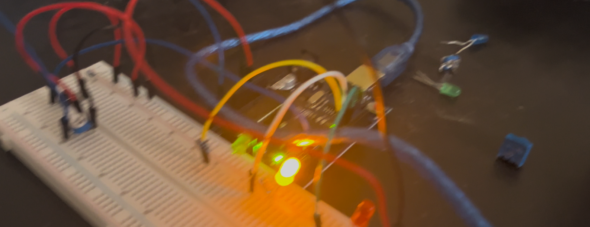

# Sending signals to program the blink rate of the LED

I just used one LED and used a variable called blinkDelay and parsed it as an integer. Then it accepts integer values to change the time delay in the range 100-1000ms.

## Video Demonstration

Click the thumbnail below:

